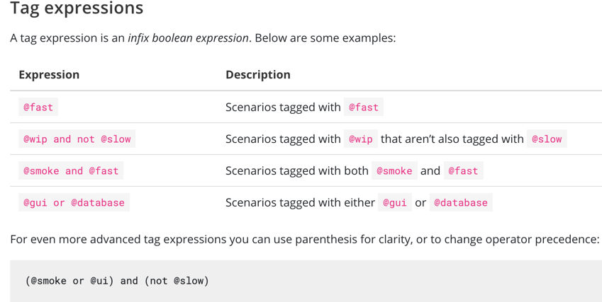

# interview-q-and-a-java-selenium-real-time-problems
This aim of this repo is to maintain the questions and solutions for typical Automation Testing Code related Interviews.

---

> * Created by <b>Akash Tyagi</b> on 10 Feb 2021 for training purposes
> * Download the whole repo and navigate to the mentioned class to execute the program in your system.

---

### List of Programs and their solutions which are being asked in  Real Time Automation Testing interviews.

### 1.Problem: Find Factorial of the Number using Recursion technique

> [Click Here for Solution](src/main/java/com/automationfraternity/_1_Factorial_Recursive.java)

---

### 2.Problem: Write a code which takes any String and prints all the words and their corresponding count

> [Click Here for Solution](src/main/java/com/automationfraternity/_2_Count_All_Words_In_String.java)

---

### 3.Problem: Remove All numbers from the String

* Use Link to know more on Regular Expression: https://www.w3schools.com/java/java_regex.asp

> [Click Here for Solution](src/main/java/com/automationfraternity/_3_RegExp_Remove_Int_From_String.java)

---

### 4. Cucumber tags And, Or, Not Operations.
    
* Tags can be sent from maven command line using: ```mvn test -Dcucumber.filter.tags="@sanity and @regression"```
* Also can be sent from cucumber options: ```@CucumberOptions(tags = "@smoke and @fast")```
  
* ```tags="@Sanity"``` :  Will Run Scenario which is tagged with Sanity. Does not matter if it has other tags as well.
* ```tags="@Sanity and @Regression"``` : Will Run Scenario which is tagged with Sanity as well as Regression.
* ```tags="@Sanity and not @Regression"``` :  Will Run Scenario which is tagged with Sanity but not Regression.
* ```tags="@Sanity or @Regression"``` : Will Run Scenario tagged with Sanity or Regression.

* Complex Case: I want to run @Sanity and @ui, but not @Regression
* ```tags="@Sanity and @ui"``` : Will Run Scenario tagged with @Sanity and @ui. But this also run test case which has @Sanity, @Ui but other tags as well.
* So, I should write: ```tags="@Sanity and @ui and (not @Regression)```

* Check this link for more: https://cucumber.io/docs/cucumber/api/

> 

* Runner File:
> [Click Here for Solution](src/main/java/com/automationfraternity/_4_Cucumber_Tags_Problem.java)

* Glue File:
> [Click Here for Solution](src/main/java/com/automationfraternity/_4_Cucumber_Tags_Problem_Glue.java)

* Feature File:
> [Click Here for Solution](src/main/resources/features/MyFeature.feature)

---

### 5. Print Patterns

* These are very common code questions people ask in the interviews.
* There is no other way then to practice them and they also help in logic building.
* Not putting in whole code here. Please check the code under ```src/main/java/com/automationfraternity/_5_Print_Patterns.java``` file.
* Usefull Link: https://www.programiz.com/java-programming/examples/pyramid-pattern

> [Click Here for Solution](src/main/java/com/automationfraternity/_5_Print_Patterns.java)

* Below patterns are Covered.
```text
Output for: m1_print_a_string_as_pyramid
      
     A
    Aka
   Akash
  Akash12
 Akash1234
Akash123456

Output for: m2_print_half_pyramid_using_star

*
**
***
****

Output for: m3_print_half_pyramid_using_numbers
1
12
123
1234
12345

Output for: m4_print_half_pyramid_using_alphabets

A
AB
ABC
ABCD

Output for: m5_print_half_pyramid_using_alphabets
A
BB
CCC
DDDD
EEEEE

Output for: m6_print_inverted_half_pyramid
*****
****
***
**
*

Output for: m7_print_inverted_pyramid_of_star
*********
 *******
  *****
   ***
    *
     
```

---

### 6. Read the Text file and Count each Word

* Counting words is already covered in Problem # 2
* In this once I am rather focusing on Reading the text files:
* There are in-fact many ways a Text file can be read in java. (This actually makes things more confusing)
* Each way has different use cases.
* I am presenting few ways here. Which are very generic for fetching the text as a String for a simple and small text file.
* Usefull Link: https://www.geeksforgeeks.org/different-ways-reading-text-file-java/

> [Click Here for Solution](src/main/java/com/automationfraternity/_6_Read_Text_File_Count_Each_Word.java)

---

### 7. Handle Web Table in Selenium. Use Xpath Axes to get the parent and sibling elements

> [Click Here for Solution](src/main/java/com/automationfraternity/_7_Selenium_Xpath_Axes_Table_Handling.java)


* Xpath Axes example to identify the parent and sibling with respect to one element
  > 
  
* Some Use-full Xpath Axes. 
* Refer link for more info: https://www.w3schools.com/xml/xpath_axes.asp
 > 
 
 > 
 
---

### 8. Singleton Class Data Base Connection

> [Click Here for Solution](src/main/java/com/automationfraternity/_8_Singleton_Pattern_For_DB.java)

---

### 9. String Manipulation Interview Questions

> [Click Here for Solution](src/main/java/com/automationfraternity/_9_Java_String_Ops_Questions.java)

* Below Questions are covered in the solution above
```text
  1. m1_get_the_max_occuring_char_in_string
  2. m2_remove_all_duplicates_from_string
  3. m3_remove_duplicate_characters_from_first_string_present_in_second_string
  4. m4_check_string_is_rotation_or_not
  5. Reverse a string
  6. print all permutations
  7. Reverse the words in the Sentence
  8. Check two string is an anagram
  9. Check String is palindrome
  10. Roman Numeral to Integer
  11. Integer to Roman Numeral
  12. How do you check if a given string contains valid parentheses?
```

---
### 16. Web Driver Listener
* Web Driver have a another implementation of Web Driver in the form of the class ```EventFiringWebDrvier```.
* This Class has all the features of a typical Web Driver but with inherent capability of logging for various web driver events.
* Please check the Impl for the same in these below two classes.
* To make selenium work, you need to add the chromedriver file in the root directory of this repo.
> This holds the Listener Class: [Click here for Solution](src/main/java/com/automationfraternity/_16_1_WebDriverEvenListenerImpl.java)
> This holds the sample Test: [Click here for Solution](src/main/java/com/automationfraternity/_16_Selenium_WebDriver_Listeners.java)

---
