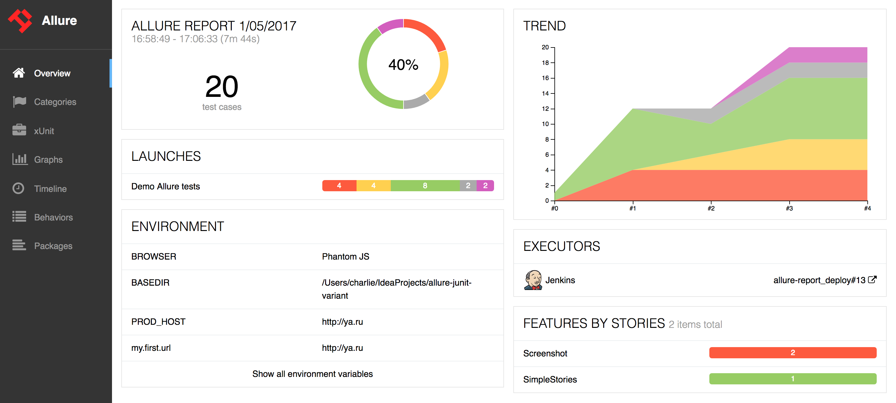

# Java Selenium Framework [](https://travis-ci.org/edinc/java-selenium-framework)

The Selenium Java Framework is a good starting point for writing your UI automated tests utilizing Java,
Selenium and Zalenium for running the tests in a CI manner.

## Features
### Multiple domains
Tests can be configured to run against different domains. For example:
https://www.some-site.de and https://www.some-site.fr.

### Multiple environments
Similar as for multiple domains the tests can also be run on multiple environments,
for example a staging and a live environment. It is as simple as changing a spring profile parameter.

### Localization
Page content can be validated with different languages through a config file.

### User data handling
Handling user data within a json file where the appropriate user will be determined by country.

### Headless
The option to run the tests in headless mode (without opening a browser).

### Zalenium integration
[Zalenium](https://github.com/zalando/zalenium) is a Selenium Grid extension to scale your local grid dynamically with docker containers.

### Allure reports integration
[Allure Framework](https://github.com/allure-framework/allure2) is a flexible lightweight multi-language test report tool that shows a very concise representation of what has been tested in a neat web report form

### Parallelization
The framework has the ability to run multiple tests in parallel. Setting this up just requires to set the `thread-count` paramenter in `testng.xml`.

## Tech Stack
* Java 8
* Maven
* Spring Boot
* TestNG
* Allure
* Zalenium

## How-to
### Local on different browsers
To run the tests on your local machine use the command:

```
mvn clean test -Dspring.profiles.active=live -Dcountry=com -Dbrowser=chrome
```

The parameters explained:
* `spring.profiles.active` - defines on which environment the tests will run
* `country` - defines on which domain the tests will run
* `browser` - defines the browser (`chrome/firefox`)


### With Zalenium
To be able to run the tests on Zalenium (which is basically just a dockerized Selenium Grid), first Zalenium has to be started.
```
# Pull docker-selenium
docker pull elgalu/selenium

# Pull Zalenium
docker pull dosel/zalenium

docker run --rm -ti --name zalenium -p 4444:4444 \
  -v /var/run/docker.sock:/var/run/docker.sock \
  -v /tmp/videos:/home/seluser/videos \
  --privileged dosel/zalenium start
```

After Zalenium is running just the browser parameter has to be changed in order to run the tests

```
mvn clean test -Dspring.profiles.active=live -Dcountry=com -Dbrowser=zalenium
```

### Headless
The latest versions of the Chrome and Firefox browsers have the feature to run browsers in headless mode. This speeds up the running time of the tests immensely. For running the tests using the headlless mode feature:

```
mvn clean test -Dspring.profiles.active=live -Dcountry=com -Dbrowser=chrome -Dmode=headless
```

where as browser either `chrome` or `firefox` can be selected.

### Running the tests on a different OS
Currently the tests are configured to run just on MacOS. But this can be changed [here](https://github.com/edinc/java-selenium-framework/blob/master/src/main/java/selenium/driver/DriverManager.java#L21) , the relative path just has to be replaced with the appropriate driver for that OS.

## Reports

Reporting of the tests results is one of the most important aspects of a framework. It doesn't matter how many and good your tests are when they are not enough visible. In this framework Allure was used to generate
visually rich and insightful reports.



Allure has to be installed before being able to show test results:

```
$ brew untap qameta/allure
$ brew update
$ brew install allure
```

After every test run the results are automatically stored in an `allure-results` directory. The results then can be seen locally by running:

```
allure serve
```

or in all popular CI's with the help of allure plugins.
## Contact

Open a github issue or for suggestions a Pull Request straight away.